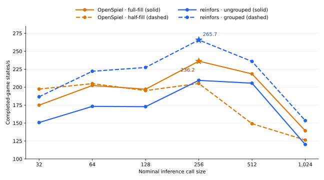

# Configuring the engines

## Result

| Stack | Selected configuration | Sizing throughput |
|---|---|---:|
| OpenSpiel | 256 actors, batch 256 (`a256`) | **236.2 states/s** |
| reinfors | 512 games, two groups (`n512_g2`) | **265.7 states/s** |

These are the maxima of the full-workload sizing sweep. Both are bracketed by lower
measurements, so neither selection is an edge-of-grid assumption. The 12.5% difference
selects the configurations used downstream; it is **not** the final matched-training
result.

Values are median completed-game states/s over three interleaved cycles. “Half-fill”
and “grouped” use twice as many games as the nominal call size.

| Call size | OpenSpiel full-fill | OpenSpiel half-fill | reinfors ungrouped | reinfors grouped |
|---:|---:|---:|---:|---:|
| 32 | 174.9 | 197.3 | 150.7 | 186.6 |
| 64 | 202.3 | 204.9 | 173.2 | 222.1 |
| 128 | 197.1 | 195.2 | 172.8 | 227.4 |
| 256 | **236.2** | 205.1 | 209.4 | **265.7** |
| 512 | 218.4 | 149.1 | 205.5 | 235.8 |
| 1,024 | 139.2 | 126.3 | 120.1 | 153.4 |

- Each stack's overall maximum occurs at a nominal call size of 256.
- At that call size, grouped `n512_g2` produces 26.9% more states/s than ungrouped
  `n256_g1` while overlapping one group's search with the other's inference.
- OpenSpiel performs best without capping its batch below its actor count.

OpenSpiel obtains batches from independently progressing actor threads. reinfors pools
games and can overlap two groups. See [design differences](design-differences.md).

## reinfors throughput levers

| Lever | Baseline | Changed | Gain |
|---|---:|---:|---:|
| Compiled callback, `n512_g2` | 224.5 eager states/s | 268.5 compiled states/s | **+19.6%** |

**Callback output dtype** — inference rows/s at 256-row calls:

| Network | Path | f64 | f32 | Gain |
|---|---|---:|---:|---:|
| w256 d8 | compiled | 16,232 | 17,036 | **+5.0%** |
| w256 d8 | eager | 13,583 | 14,341 | **+5.6%** |
| w128 d8 | compiled | 24,330 | 26,539 | **+9.1%** |
| w128 d8 | eager | 22,131 | 23,661 | **+6.9%** |

| Cache capacity | States/s | Hit rate |
|---:|---:|---:|
| 4,096 | 240.6 | 0.5% |
| 32,768 | 253.1 | 13.5% |
| 262,144 | 269.9 | 21.0% |

A 2M-entry cache exhausted the 30 GB host during the first collection, so the sweep
stops at 262,144. That is a host-memory limit, not a throughput observation.

## Compiled batch response

Pure compiled forwards continue improving beyond the selected 256-row call. The
training sweep therefore turns over because of the complete workload, not because the
GPU kernel has reached its best batch size.

| Batch | Rows/s | µs/row |
|---:|---:|---:|
| 32 | 14,602 | 68.5 |
| 64 | 17,562 | 56.9 |
| 128 | 17,164 | 58.3 |
| 256 | 24,507 | 40.8 |
| 512 | 19,666 | 50.8 |
| 1,024 | 26,517 | 37.7 |
| 2,048 | 26,980 | 37.1 |
