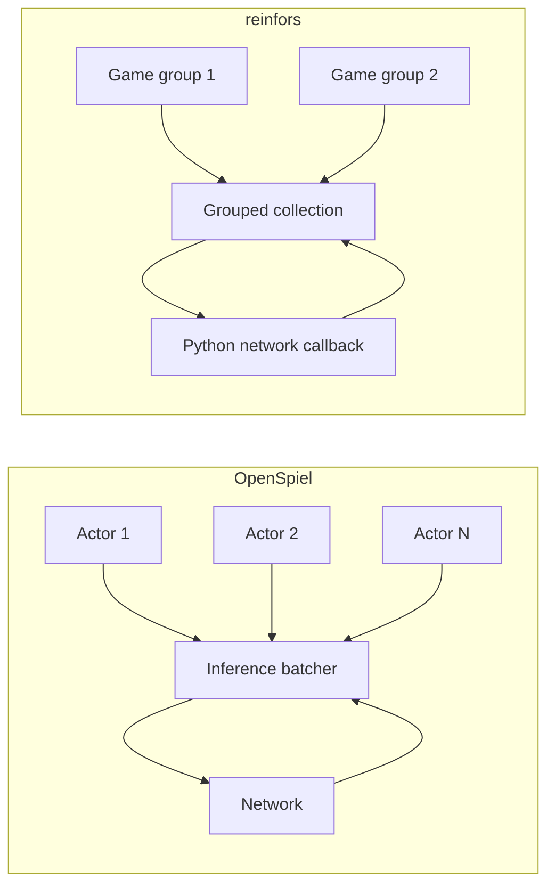

# Design differences

The comparison preserves each stack's native architecture. These differences explain
the results; they are not benchmark defects.

## Batch formation

OpenSpiel forms batches from independently progressing actor threads. Increasing its
batch supply therefore also increases CPU concurrency. reinfors pools search leaves
across games and can overlap two groups, allowing call size and total games to differ.
The [configuration sweep](configuring-the-engines.md) measures the resulting trade-off.

Neither configured count equals the eventual callback width. Cache hits, terminal
simulations and deduplication remove rows, while more games increase in-flight work at a
hard deadline.

## Other structural differences

| Area | OpenSpiel | reinfors | Consequence |
|---|---|---|---|
| Network query | Value and policy are separate evaluator queries; the cache merges them. | One callback returns both outputs. | Cache lookup and eviction semantics differ. |
| Training schedule | Periodic full-buffer sweeps. | Continuous caller-owned Python training. | Device contention and weight staleness have different shapes. |
| Search progress | Independent actors. | Lockstep pooled rounds, optionally grouped. | Different per-game latency and batch formation. |
| Extension model | C++ bots and evaluators. | Rust games/search with injectable Python networks. | Different flexibility and integration costs. |

## Why caches are not disabled

The caches are part of each intended architecture. Disabling them roughly doubles
OpenSpiel's network forwards per expanded node while leaving reinfors' fused query
unchanged, so cache-off would not be a neutral comparison. V1 instead gives both stacks
the same capacity and reports their cache telemetry without equating their hit-rate
definitions.

## Boundaries

OpenSpiel prioritizes breadth and reference clarity; reinfors prioritizes modular
batched search and caller-owned training. V1 measures one point in that design space.
It does not establish how either architecture scales with more CPU cores, other games or
multiple devices.
